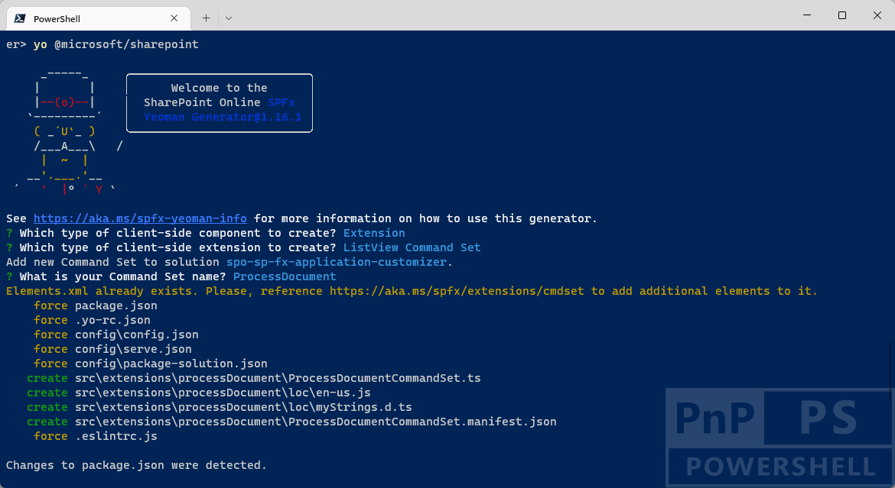
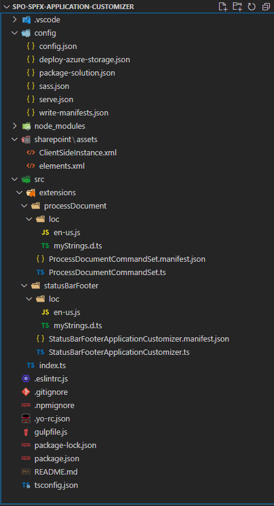

# From Status Bars, Notifications, and Dialogs to SPFx Application Customizers and Dialog Framework

In the SharePoint Add-in model you were used to rely on the JavaScript Object Model for SharePoint to show notifications, status bars, and dialog windows using syntax like the following:

```JavaScript
// Sample syntax to show and hide a notification area
var notifyId = SP.UI.Notify.addNotification('Notification message ...', true);
SP.UI.Notify.removeNotification(notifyId);

// Sample syntax to show and hide a status bar with red background color
var statusId = SP.UI.Status.addStatus('Status message ...');
SP.UI.Status.setStatusPriColor(this.statusId, 'red');
SP.UI.Status.removeStatus(statusId);

// Sample syntax to show a dialog window
var options = SP.UI.$create_DialogOptions();
options.url = '{SiteUrl}/_layouts/MyAddin/' + 'MyAddinDialog.aspx';
options.autoSize = true;
options.dialogReturnValueCallback = Function.createDelegate(null, dialogCloseCallback);
this.dialog = SP.UI.ModalDialog.showModalDialog(options);

// Function to handle dialog close callback
function dialogCloseCallback(result, returnValue) {
  if (result == SP.UI.DialogResult.OK) {
    window.alert('You clicked OK! And selected a status of: ' + returnValue);
  } else if (result == SP.UI.DialogResult.cancel) {
    window.alert('You clicked Cancel!');
  } 

  SP.UI.ModalDialog.RefreshPage(result);
}
```

Nowadays, with SharePoint Framework, you can rely on the Application Customizer extensions and to the SharePoint Framework Dialog Framework to achieve the same result and even more. In this article you can find detailed information about how to transform notifications, status bars, and dialog windows of the SharePoint Add-in model into SharePoint Framework modern solutions.

> [!NOTE]
> You can find further details about creating a SharePoint Framework Application Customizer by reading the documents [Build your first SharePoint Framework Extension (Hello World part 1)](https://learn.microsoft.com/en-us/sharepoint/dev/spfx/extensions/get-started/build-a-hello-world-extension) and (Use page placeholders from Application Customizer (Hello World part 2))[https://learn.microsoft.com/en-us/sharepoint/dev/spfx/extensions/get-started/using-page-placeholder-with-extensions].

> [!NOTE]
> You can additional information about the SharePoint Framework Dialog Framework by reading the document [Use custom dialog boxes with SharePoint Framework Extensions](https://learn.microsoft.com/en-us/sharepoint/dev/spfx/extensions/guidance/using-custom-dialogs-with-spfx).

## Setting the context
Imagine that you need to provide a custom action in the UI of a Document Library in SharePoint Online and you want to show a dialog window to collect information from the user. Once the user provides the requested data, you want to inform her or him through a custom status bar. In order to achieve this result, you will need to create a List View Command Set and an Application Customizer.

> [!NOTE]
> You can learn how to create a List View Command Set by reading the document [Build your first ListView Command Set extension](https://learn.microsoft.com/en-us/sharepoint/dev/spfx/extensions/get-started/building-simple-cmdset-with-dialog-api) and if you need to transform an already existing SharePoint Add-in model solution with a custom command into a modern SharePoint Framework solution, you can read the document (From UI Extensions to SharePoint Framework List View Command Sets)[./From-UI-Extensions-to-List-View-Command-Sets.md].

In the following screenshot, you can see how the custom dialog looks like in the modern UI of SharePoint Online.


While in the following screenshot, you can see how an hypothetical footer looks like, when built leveraging a  SharePoint Framework Application Customizer, in order to implement a "Status Bar"-like experience.


## Creating a SharePoint Framework solution
In order to achieve the above result, let's start by creating a new SharePoint Framework solution.
First of all, you need to scaffold the SharePoint Framework solution, so start a command prompt or a terminal window, create a folder, and from within the newly created folder run the following command.

> [!IMPORTANT]
> In order to being able to follow the illustrated procedure, you need to have SharePoint Framework installed on your development environment. You can find detailed instructions about how to set up your environment reading the document [Set up your SharePoint Framework development environment](https://learn.microsoft.com/en-us/sharepoint/dev/spfx/set-up-your-development-environment).


```PowerShell
yo @microsoft/sharepoint
```


Follow the prompts to scaffold a solution for a modern Application Customizer. Specifically, make the following choices, when prompted by the tool:
* What is your solution name? **spo-sp-fx-application-customizer**
* Which type of client-side component to create? **Extension**
* Which type of client-side extension to create? **Application Customizer**
* What is your Application Customizer name? **StatusBarFooter**

With the above answers, you decided to create a solution with name *spo-sp-fx-application-customizer*, in which there will be a custom extension of type Application Customizer with name *StatusBarFooter*.

Now, from whitin the same folder as before, run the scaffolding tool one more time. When you run the *@microsoft/sharepoint* generator multiple times against an already scaffolded solution, the tool will simply add the new generated code to the existing solution.



Follow the prompts to scaffold an additional List View Command Set. Specifically, make the following choices, when prompted by the tool:
* Which type of client-side component to create? **Extension**
* Which type of client-side extension to create? **ListView Command Set**
* What is your Application Customizer name? **ProcessDocument**

With the above answers, you decided enrich the just scaffolded solution with a custom extension of type ListView Command Set with name *ProcessDocument*.

Now you have the SharePoint Framework solution ready to be customized. When it's done you can simply open the current folder using your favorite code editor. However, before opening the solution you will need to add a package to have an easy and better looking rendering of the UI of your extension. In fact, you are going to reference the MGT (Microsoft Graph Toolkit) library of components and the React framework by running the following commands:

```PowerShell
npm install @microsoft/mgt-spfx @microsoft/mgt-react react@17.0.1 react-dom@17.0.1 --save
npm install @types/react@17.0.45 @types/react-dom@17.0.17 --save-dev
```

In fact, by default the scaffolded solution for a SharePoint Framework List View Command Set does not include the React packages, and it is up to you to choose to add them to the solution.

> [!NOTE]
> The Microsoft Graph Toolkit is a set of components to speed up the rendering of the UI of your client-side solutions, including SharePoint Framework solutions. It is not mandatory to use it in this sample solution, but it is an easy way to speed up your learning and development process. You can find detailed information about MGT reading the document [Microsoft Graph Toolkit overview](https://learn.microsoft.com/en-us/graph/toolkit/overview) and you can learn how to integrate MGT with SharePoint Framework reading the document [SharePoint Framework library for Microsoft Graph Toolkit](https://learn.microsoft.com/en-us/graph/toolkit/get-started/mgt-spfx).

Now you can open the solution in your favorite code editor. If your favorite code editor is Microsoft Visual Studio Code, simply run the following command:

```PowerShell
code .
```

In the following image, you can see the outline of the generated SharePoint Framework solution.



As you can see, under the *src/* folder there are two subfolders, one for the Application Customizer with name *statusBarFooter* and one for the ListView Command Set with name *processDocument*.

### Defining the ListView Command Set
Let's start by defining the ListView Command Set.

```TypeScript
```

### Defining the Application Customizer
Let's start by defining the ListView Command Set.

```TypeScript
```

